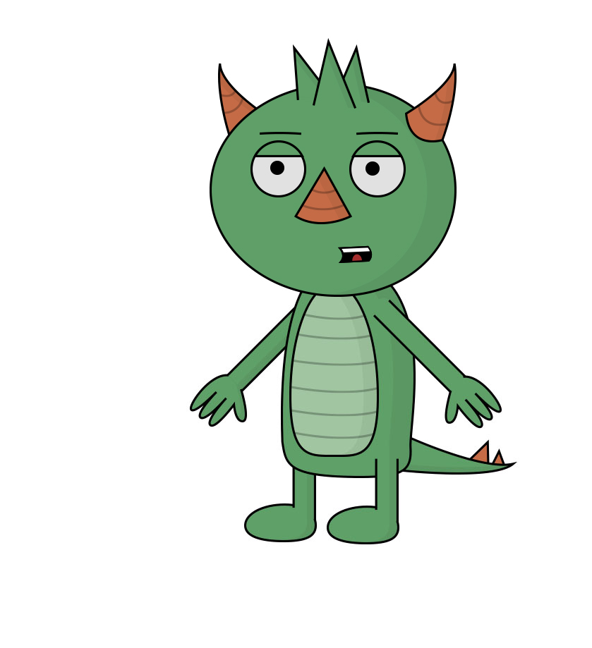
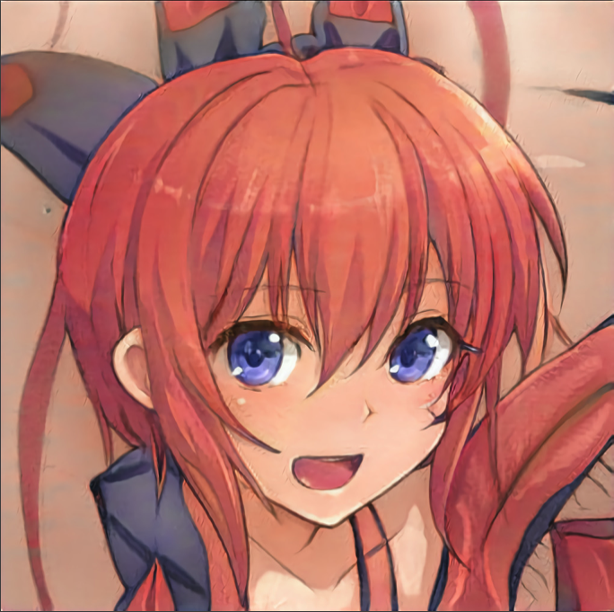
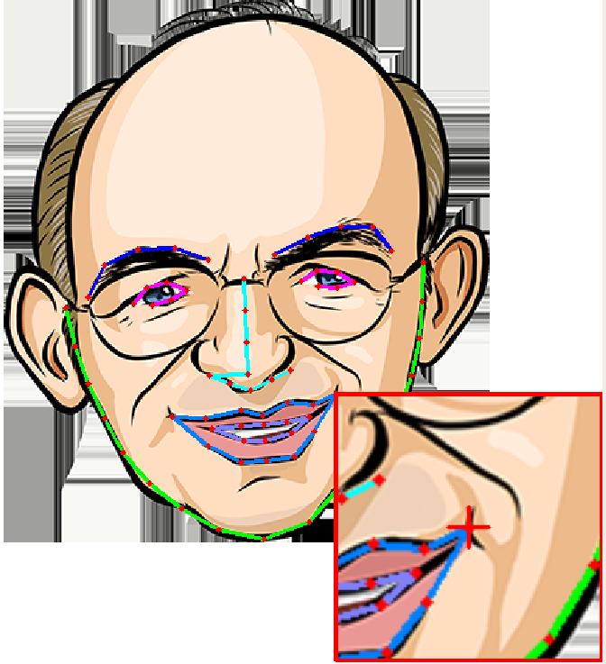
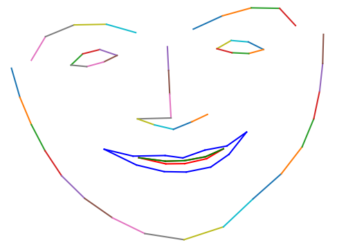
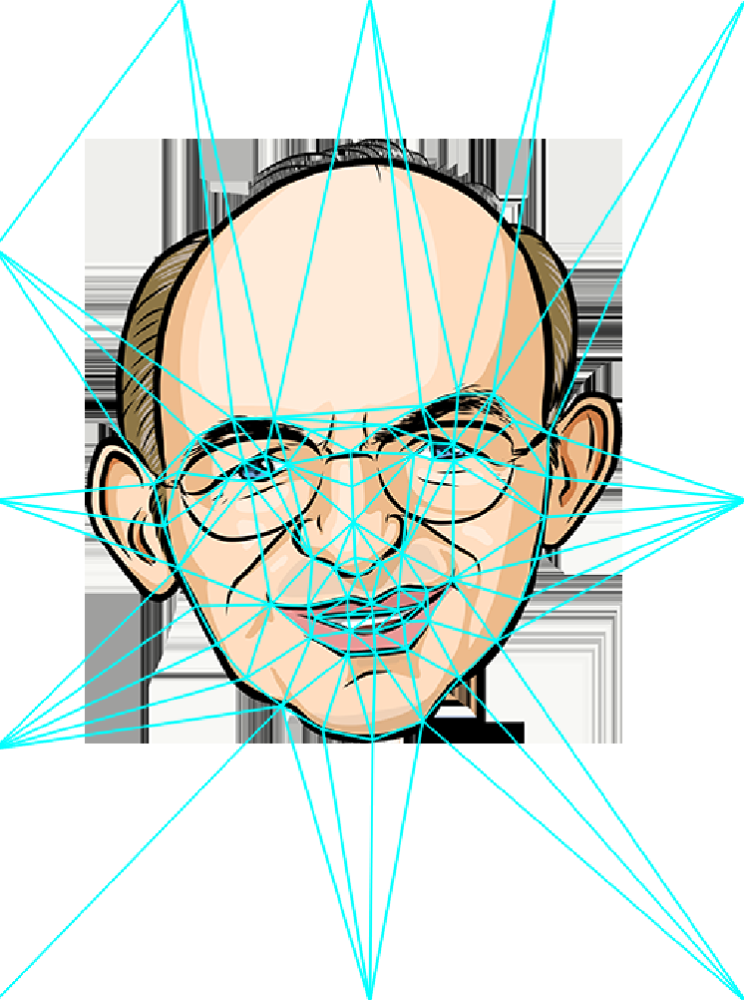

# MakeItTalk: Speaker-Aware Talking-Head Animation

This is the code repository implementing the paper:

> **MakeItTalk: Speaker-Aware Talking-Head Animation**
>
> [Yang Zhou](https://people.umass.edu/~yangzhou), 
> [Xintong Han](http://users.umiacs.umd.edu/~xintong/), 
> [Eli Shechtman](https://research.adobe.com/person/eli-shechtman), 
> [Jose Echevarria](http://www.jiechevarria.com) , 
> [Evangelos Kalogerakis](https://people.cs.umass.edu/~kalo/), 
> [Dingzeyu Li](https://dingzeyu.li)
>
> SIGGRAPH Asia 2020
>
> **Abstract** We present a method that generates expressive talking-head videos from a single facial image with audio as the only input. In contrast to previous attempts to learn direct mappings from audio to raw pixels for creating talking faces, our method first disentangles the content and speaker information in the input audio signal. The audio content robustly controls the motion of lips and nearby facial regions, while the speaker information determines the specifics of facial expressions and the rest of the talking-head dynamics. Another key component of our method is the prediction of facial landmarks reflecting the speaker-aware dynamics. Based on this intermediate representation, our method works with many portrait images in a single unified framework, including artistic paintings, sketches, 2D cartoon characters,  Japanese mangas, and stylized caricatures.
In addition, our method generalizes well for faces and characters that were not observed during training. We present extensive quantitative and qualitative evaluation of our method, in addition to user studies, demonstrating generated talking-heads of significantly higher quality compared to prior state-of-the-art methods.
>
> [[Project page]](https://people.umass.edu/~yangzhou/MakeItTalk/) 
> [[Paper]](https://people.umass.edu/~yangzhou/MakeItTalk/MakeItTalk_SIGGRAPH_Asia_Final_round-5.pdf) 
> [[Video]](https://www.youtube.com/watch?v=OU6Ctzhpc6s) 
> [[Arxiv]](https://arxiv.org/abs/2004.12992)
> [[Colab Demo]](quick_demo.ipynb)
> [[Colab Demo TDLR]](quick_demo_tdlr.ipynb)


Figure. Given an audio speech signal and a single portrait image   as input (left), our model generates speaker-aware talking-head animations (right). 
Both the speech signal and the input face image are not observed during the model training process.
Our method creates both non-photorealistic cartoon animations (top) and natural human face videos (bottom).

## Updates

- [x] Generate new puppet! (tested on Ubuntu)
- [x] Pre-trained models
- [x] Google colab quick demo for natural faces [[detail]](quick_demo.ipynb) [[TDLR]](quick_demo_tdlr.ipynb)
- [ ] Training code for each module

## Requirements
- Python environment 3.6
```
conda create -n makeittalk_env python=3.6
conda activate makeittalk_env
```
- ffmpeg (https://ffmpeg.org/download.html)
```
sudo apt-get install ffmpeg
```
- python packages
```
pip install -r requirements.txt
```
- `winehq-stable` for cartoon face warping in Ubuntu (https://wiki.winehq.org/Ubuntu). Tested on Ubuntu16.04, wine==5.0.3.
```
sudo dpkg --add-architecture i386
wget -nc https://dl.winehq.org/wine-builds/winehq.key
sudo apt-key add winehq.key
sudo apt-add-repository 'deb https://dl.winehq.org/wine-builds/ubuntu/ xenial main'
sudo apt update
sudo apt install --install-recommends winehq-stable
```

## Pre-trained Models

Download the following pre-trained models to `examples/ckpt` folder for testing your own animation.

| Model |  Link to the model | 
| :-------------: | :---------------: |
| Voice Conversion  | [Link](https://drive.google.com/file/d/1ZiwPp_h62LtjU0DwpelLUoodKPR85K7x/view?usp=sharing)  |
| Speech Content Module  | [Link](https://drive.google.com/file/d/1r3bfEvTVl6pCNw5xwUhEglwDHjWtAqQp/view?usp=sharing)  |
| Speaker-aware Module  | [Link](https://drive.google.com/file/d/1rV0jkyDqPW-aDJcj7xSO6Zt1zSXqn1mu/view?usp=sharing)  |
| Image2Image Translation Module  | [Link](https://drive.google.com/file/d/1i2LJXKp-yWKIEEgJ7C6cE3_2NirfY_0a/view?usp=sharing)  |
| Non-photorealistic Warping (.exe)  | [Link](https://drive.google.com/file/d/1rlj0PAUMdX8TLuywsn6ds_G6L63nAu0P/view?usp=sharing)  |

## Animate You Portraits!

- Download pre-trained embedding [[here]](https://drive.google.com/file/d/18-0CYl5E6ungS3H4rRSHjfYvvm-WwjTI/view?usp=sharing) and save to `examples/dump` folder.

### _Nature Human Faces / Paintings_

- crop your portrait image into size `256x256` and put it under `examples` folder with `.jpg` format. 
Make sure the head is almost in the middle (check existing examples for a reference).

- put test audio files under `examples` folder as well with `.wav` format.

- animate!

```
python main_end2end.py --jpg <portrait_file>  
```

- use addition args `--amp_lip_x <x> --amp_lip_y <y> --amp_pos <pos>` 
to amply lip motion (in x/y-axis direction) and head motion displacements, default values are `<x>=2., <y>=2., <pos>=.5`


### _Cartoon Faces_ 

- put test audio files under `examples` folder as well with `.wav` format.

- animate one of the existing puppets

| Puppet Name |  wilk | roy | sketch | color | cartoonM | danbooru1 | 
| :---: | :---: | :---: | :---: | :---: | :---: | :---: |
| Image  |   |   |   |   |   |   |

```
python main_end2end_cartoon.py --jpg <cartoon_puppet_name_with_extension> --jpg_bg <puppet_background_with_extension>
```

- `--jpg_bg` takes a same-size image as the background image to create the animation, such as the puppet's body, the overall fixed background image. If you want to use the background, make sure the puppet face image (i.e. `--jpg` image) is in `png` format and is transparent on the non-face area. If you don't need any background, please also create a same-size image (e.g. a pure white image) to hold the argument place.

- use addition args `--amp_lip_x <x> --amp_lip_y <y> --amp_pos <pos>` 
to amply lip motion (in x/y-axis direction) and head motion displacements, default values are `<x>=2., <y>=2., <pos>=.5`

### _Generate Your New Puppet_ 

- put the cartoon image under `examples_cartoon`

- install conda environment `foa_env_py2` (tested on python 2) for Face-of-art (https://github.com/papulke/face-of-art).
 Download the pre-trained weight [here](https://www.dropbox.com/sh/hrxcyug1bmbj6cs/AAAxq_zI5eawcLjM8zvUwaXha?dl=0) and put it under `examples/ckpt`. 
 Activate the environment.

```
source activate foa_env_py2
```

- create necessary files to animate your cartoon image, i.e. 
`<your_puppet>_open_mouth.txt`, `<your_puppet>_close_mouth.txt`, `<your_puppet>_open_mouth_norm.txt`, `<your_puppet>_scale_shift.txt`, `<your_puppet>_delauney.txt`

```
python main_gen_new_puppet.py <your_puppet_with_file_extension>
```

- in details, it takes 3 steps
    - Face-of-art automatic cartoon landmark detection.
    - If it's wrong or not accurate, you can use our tool to drag and refine the landmarks.
    - Estimate the closed mouth landmarks to serve as network input.
    - Delauney triangulate the image with landmarks. 
    
- check puppet name `roy_example.png` for an example. 

|  |  | 
| :---: | :---: | :---: |
| Landmark Adjustment Tool |  Closed lips estimation | Delaunay Triangulation |

## Train

### Train Voice Conversion Module
Todo...

### Train Content Branch
- Create dataset root directory `<root_dir>`

- Dataset: Download preprocessed dataset [[here]](https://drive.google.com/drive/folders/1EwuAy3j1b9Zc1MsidUfxG_pJGc_cV60O?usp=sharing), and put it under `<root_dir>/dump`.

- Train script: Run script below. Models will be saved in `<root_dir>/ckpt/<train_instance_name>`.

    ```shell script
    python main_train_content.py --train --write --root_dir <root_dir> --name <train_instance_name>
    ```
  
### Train Speaker-Aware Branch
Todo...

### Train Image-to-Image Translation

Todo...

## [License](LICENSE.md)

## Acknowledgement

We would like to thank Timothy Langlois for the narration, and
[Kaizhi Qian](https://scholar.google.com/citations?user=uEpr4C4AAAAJ&hl=en) 
for the help with the [voice conversion module](https://auspicious3000.github.io/icassp-2020-demo/). 
We thank [Jakub Fiser](https://research.adobe.com/person/jakub-fiser/) for implementing the real-time GPU version of the triangle morphing algorithm. 
We thank Daichi Ito for sharing the caricature image and Dave Werner
for Wilk, the gruff but ultimately lovable puppet. 

This research is partially funded by NSF (EAGER-1942069)
and a gift from Adobe. Our experiments were performed in the
UMass GPU cluster obtained under the Collaborative Fund managed
by the MassTech Collaborative.

